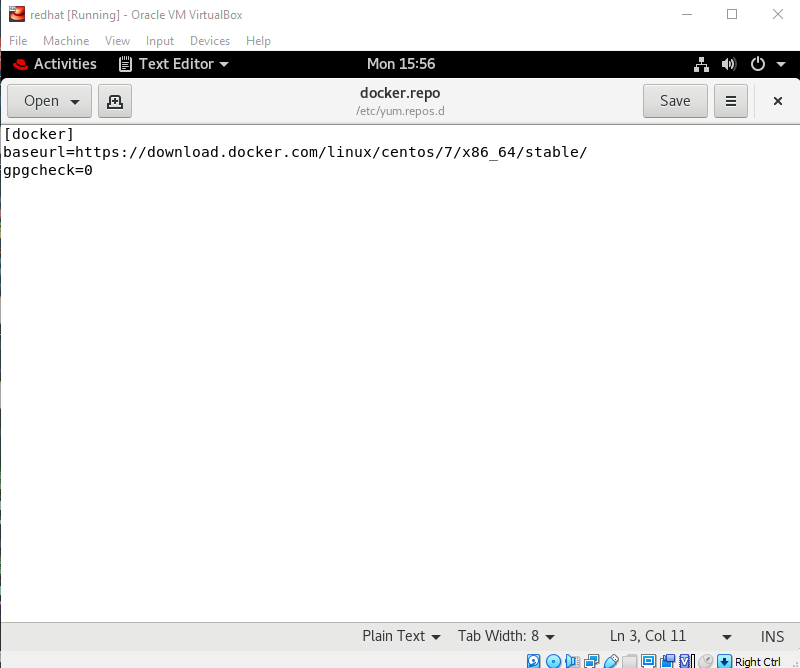

# Docker Compose Project

This image is a boilerplate for any Flask application, pages are served by uwsgi and Nginx.It provides a webpage through which user can build up his webpage on hos own.

## Intro to Flask:

Flask is a lightweight WSGI web application framework. It is designed to make getting started quick and easy, with the ability to scale up to complex applications. It began as a simple wrapper around Werkzeug and Jinja and has become one of the most popular Python web application frameworks.

Flask offers suggestions, but doesn't enforce any dependencies or project layout. It is up to the developer to choose the tools and libraries they want to use. There are many extensions provided by the community that make adding new functionality easy.

``` Python
from flask import Flask, escape, request

app = Flask(__name__)

@app.route('/')
def hello():
  name = request.args.get("name", "World")
  return f'Hello, {escape(name)}!'
```

### Pre-requisites:

- OS: Redhat Enterprise Linux or CentOS 8
- Docker engine
- Docker Image
- Docker Compose Up

**For docker installation on Redhan/Centos**

- Configure you yum repository by adding the docker.repo in the `/etc/yum.repos.d/ for local installation in folllowing manner:
In your terminal run the following commands-
```
[root@localhost ~]# cd /etc/yum.repos.d/
[root@localhost yum.repos.d]# ls
[root@localhost yum.repos.d]# gedit docker.repo
```
Now you have to write as following in your docker repo-



Congratulation! your docker repo has been configured. 

**Requirements/Installation**

Make sure you have the latest version of Docker and Docker compose on your system.If not than run the following commands:
```
dnf remove docker-ce
dnf list docker-ce
dnf install docker-ce
```
### About Project

This project works on Nginx engine. User will commit this project in his prefferable location and by using `docker-compose up`.Nginx engine will be initialize and now user can access the page by using the ip_address of the host system.

**for further details contact-** prateekgupta7500@gmail.com
